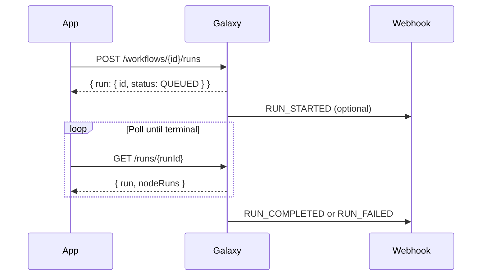

Galaxy is an AI workflow platform. Use the REST API to create workflows, start runs, poll results, and receive lifecycle webhooks — all with API key authentication.

## What you can do

- **Execute workflows** — start full or partial runs and retrieve node outputs
- **Manage workflows** — list, create, update, and delete workflow definitions
- **Monitor runs** — poll run status or subscribe to outbound webhooks
- **Manage access** — create and revoke API keys with per-key rate limits
- **Use MCP** — connect Claude, Cursor, or other MCP clients to build and run workflows from chat

## MCP Server

Galaxy also exposes a [Model Context Protocol](/mcp-server/overview) server at:

```
https://galaxy-backend-kappa.vercel.app/api/mcp
```

Use the same Bearer API key as the REST API. See [MCP Setup](/mcp-server/setup) for client configuration.

## Base URL

| Environment | Base URL |
| --- | --- |
| Production API | `https://galaxy-backend-kappa.vercel.app/api/v1` |
| Production app | `https://galaxy-frontend-five.vercel.app` |
| Local backend | `http://localhost:4010/api/v1` |
| Local (via frontend proxy) | `http://localhost:3000/api/v1` |

All paths in this documentation are relative to `/api/v1`.

## Documentation map

<CardGroup cols={2}>
  <Card title="Setup" icon="server" href="/setup">
    Install, configure environment variables, and run locally.
  </Card>
  <Card title="Authentication" icon="key" href="/authentication">
    API keys, Bearer tokens, and rate limiting.
  </Card>
  <Card title="Workflows" icon="diagram-project" href="/workflows">
    Workflow CRUD, run scopes, idempotency, and polling.
  </Card>
  <Card title="Nodes" icon="cube" href="/nodes">
    Available node types and the public node catalog endpoint.
  </Card>
  <Card title="Webhooks" icon="webhook" href="/webhooks">
    Outbound lifecycle events and signature verification.
  </Card>
  <Card title="Examples" icon="code" href="/examples">
    Copy-paste examples in curl, Python, and JavaScript.
  </Card>
  <Card title="MCP Server" icon="plug" href="/mcp-server/overview">
    Connect AI assistants to build and run workflows via MCP tools.
  </Card>
</CardGroup>

## OpenAPI specification

The machine-readable spec is served at:

```
GET /api/v1/openapi.json
```

No authentication required. The **API Reference** section in this site is generated from that spec.

## Typical integration flow



Next: [Setup](/setup) → [Quickstart](/quickstart)
